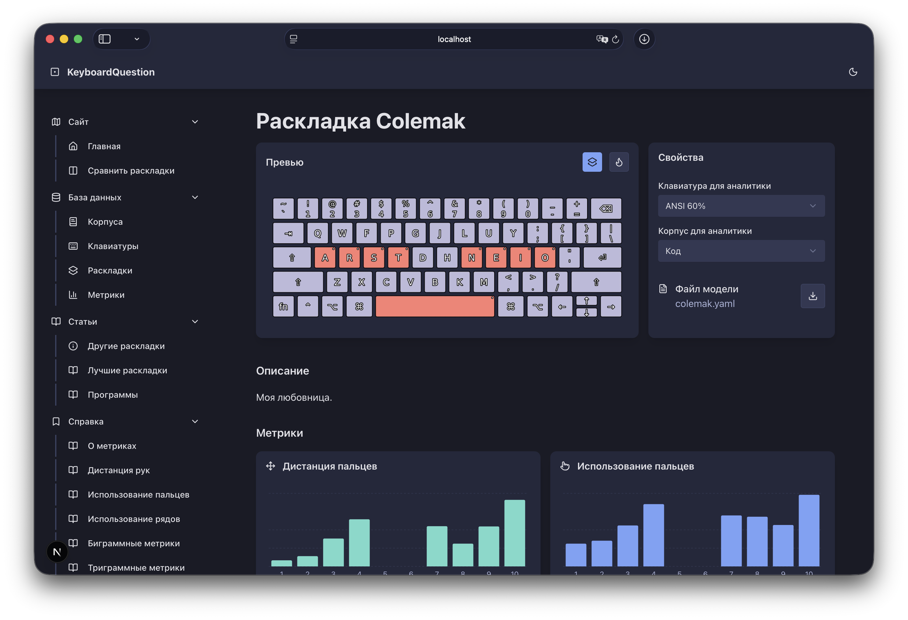
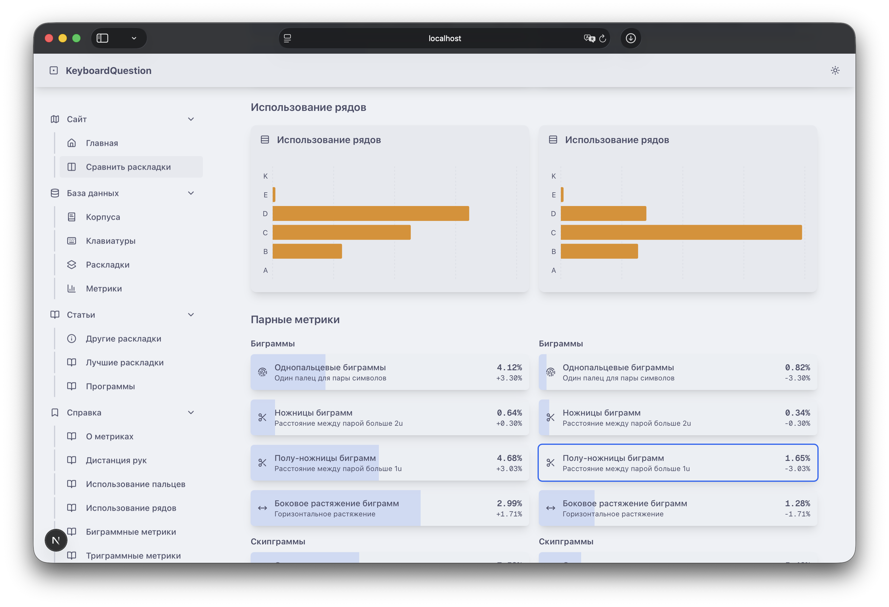

# KeyboardQuestion frontend
This is a frontend app for KeyboardQuestion project. Build on top of shadcn with Talwind CSS. Uses Typescript, and backend API to view, filter and explore and compare metrics of keyboard layouts.

> [!NOTE]  
> Analyzer is located in [separate repository](https://github.com/Catalyst-42/keyboard-question-analyzer)

> [!NOTE]  
> Backend is located in [separate repository](https://github.com/Catalyst-42/keyboard-question-backend)

## Images
|  |  |
|-|-|

## Setup
First, install all dependencies via npm:

```sh
npm i
```

To use system you need to launch backend app and fill it with info, collected via analyzer. It all good, app will use backend via proxy pass. Create `.env.local` to statisty backend api url. Here's the example of a file:

```ini
NEXT_PUBLIC_API_BASE_URL=http://localhost:8000/api
NEXT_PUBLIC_BASE_PATH=
```

## Launch
Run the development server:

```bash
npm run dev
```

Now app should be available at `localhost:3000`.

<!-- 
TODO:

- [x] Normal readme
- [ ] Folded header for metric info
- [x] Pages about system
- [x] Preffered direction for metric-card in diff
- [ ] Reduce makeFinger* bullshit array, move it to utils
- [ ] Optimize data gathering, use memo/cache
- [ ] Make PlotFingerUsage auto calc usage by hands
- [ ] Rename metric names in metric list page
- [ ] Read all scrappy topics again
-->
